# Pareto Execution Plan: go-linter-sdk Full Backlog

**Date:** 2026-08-08 10:55 CEST
**Scope:** All 50 items from `docs/status/2026-08-08_10-45` section f), cross-referenced with `TODO_LIST.md` (5 items) and `ROADMAP.md` (5 themes, 2 open questions).
**Method:** Pareto principle — identify the 1% / 4% / 20% that deliver disproportionate value, then exhaustively plan ALL work including the remaining 20%.

---

## The Real Question

**Why does this SDK exist?** To eliminate converter code (`branching-flow`: 1,871 LOC, `erraudit`: 1,214 LOC). **Zero consumers have migrated.** The value proposition is unproven beyond a single pilot rule (`examples/no-go-mod`).

Everything we plan must serve one of two goals:
1. **Prove the value** (consumer adoption)
2. **Earn the right to be trusted** (quality bar, tests, docs)

---

## Step 1: Pareto Breakdown

### The 1% that delivers 51% of the result

| Task | Why it's 51% | Effort |
| --- | --- | --- |
| Fix the 2 `bloop` warnings (`b.N` -> `b.Loop()`) | Zero diagnostics = credible quality bar. Two consecutive sessions skipped lint. This is the foundation everything else stands on. | 5m |
| Run `nix run .#lint` | Canonical quality gate per AGENTS.md. Third session in a row that would skip it otherwise. | 10m |
| Run `nix run .#test-race` | Verify race-clean status (concurrent registry is the core selling point). | 10m |
| Run `nix flake check` | Validate the flake end-to-end. | 10m |

**Total: ~35m.** If we do nothing else, the repo goes from "2 warnings, quality gate unverified for 2 sessions" to "zero diagnostics, full quality gate green."

### The 4% that delivers 64% of the result

| Task | Why it's 64% | Effort |
| --- | --- | --- |
| Integration tests for both example binaries | The examples are the SDK's primary validation evidence. They have zero automated tests. One refactor and they silently rot. | 60m |
| Refactor `validateRuleIdentity` + `RuleMeta.Validate` | Eliminates known code duplication (AGENTS.md: "Fix issues on sight"). Both check the same 4 fields through different paths. | 20m |
| Fuzz `NewRuleError` with nil cause | Edge-case robustness on the error path. `Error()` formats with `%v` — a nil cause is untested. | 15m |
| Test `errors.Is` propagation (Canceled + DeadlineExceeded) | Contract verification that context errors chain correctly through `RuleError.Unwrap()`. | 20m |
| Test `Deregister` during concurrent `Run` | Documents and verifies the snapshot semantics (a rule deregistered after `All()` snapshot but before execution still runs). | 20m |

**Total: ~2h15m.** The SDK goes from "works" to "works AND is proven to work" across all edge cases.

### The 20% that delivers 80% of the result

| Task | Why it matters | Effort |
| --- | --- | --- |
| README polish (6 items) | The README is the sales page. It's the first thing any potential consumer sees. Currently missing: Status callout, data-flow diagram, ASCII fallback for pkg.go.dev, Quick Start section, full consistency audit, API symbol verification. | 2h30m |
| CONTRIBUTING.md update | Contributors don't know the conventions for `examples/` code. | 15m |
| HARVEST pass over 3 most recent `2026-07-*` reports | Catch any unresolved items that the `2026-08-*` reports don't cover. | 30m |
| Annotate 6 older `2026-07-*` status reports | Historical doc hygiene — resolve numbered items inline. | 45m |
| Export `ErrMissingFields` | Consumers need to distinguish validation failures from runtime failures. | 15m |
| `RuleErrors(err) []*RuleError` helper | Ergonomics for `ContinueOnError` results — today callers can't easily enumerate individual failures. | 20m |

**Total: ~4h35m.** The project goes from "functional but rough around the edges" to "credible open-source library."

### The other 20% (to reach 100%)

| Category | Items | Effort | Why deferred |
| --- | --- | --- | --- |
| Consumer adoption pilots | branching-flow port, erraudit port, go-structure-linter migration, migration guide, cmd/ CLI, flag parsing | 5h+ | HIGH value but requires deep knowledge of sibling repos. Should follow quality/testing/README work. |
| API surface ergonomics | NewRegistryFromRules, Filter type, severity-tiered exit codes, ExitCodeFromFindings, RuleSet wrapper, Category.All(), map index, generics eval | 3h+ | LOW urgency — core is stable and intentionally minimal. Wait for consumer feedback. |
| Tooling & CI parity | flake checks, nix apps, Renovate, direnv, meta.position, pkg.go.dev badge | 2h+ | Nice-to-have. CI already works. |
| Publication readiness | pkg.go.dev badge, go.work workspace, self-based versioning | 1h+ | Blocked on decisions (ROADMAP Q2/Q3). |

---

## Step 2: Comprehensive Plan (30-100min tasks)

27 tasks, sorted by impact/effort/customer-value. Each is a self-contained unit of work.

| # | Task | Tier | Impact | Effort | Source | Dependencies |
| --- | --- | --- | --- | --- | --- | --- |
| M1 | Fix 2 bloop warnings + run full quality gate (lint, race, flake check) | 1% | Critical | 35m | TODO_LIST + status §f.1-4 | None |
| M2 | Integration test: examples/minimal-linter (build, run, assert exit code) | 4% | High | 30m | TODO_LIST #1 | M1 |
| M3 | Integration test: examples/no-go-mod (build, run, assert exit code) | 4% | High | 30m | TODO_LIST #1 | M1 |
| M4 | Refactor validateRuleIdentity + RuleMeta.Validate to share logic | 4% | High | 30m | TODO_LIST #5 | M1 |
| M5 | Edge-case tests: fuzz NewRuleError nil + errors.Is context propagation | 4% | High | 30m | TODO_LIST #2-3 | M1 |
| M6 | Test Deregister during concurrent Run + document snapshot semantics | 4% | Medium | 30m | TODO_LIST #4 | M1 |
| M7 | README: add Status callout near top + Quick Start section | 20% | High | 30m | status §f.18,21 | None |
| M8 | README: data-flow diagram + ASCII fallback for mermaid | 20% | Medium | 30m | status §f.19-20 | None |
| M9 | README: full consistency audit + API symbol verification | 20% | High | 45m | status §f.22-23 | M7, M8 |
| M10 | Export ErrMissingFields + add RuleErrors helper | 20% | Medium | 30m | status §f.14-15, ROADMAP T1 | M1 |
| M11 | HARVEST pass over 3 most recent 2026-07-* status reports | 20% | Medium | 30m | status §f.5,43 | None |
| M12 | Annotate 6 older 2026-07-* status reports (resolve numbered items) | 20% | Low | 45m | status §f.43 | M11 |
| M13 | CONTRIBUTING.md: add examples/ directory guidance | 20% | Low | 15m | status §f.39 | None |
| M14 | Registry.Len() + RegisterAll() convenience methods | other | Low | 30m | status §f.16-17, ROADMAP T1 | M1 |
| M15 | NewRegistryFromRules constructor + ExitCodeFromFindings convenience | other | Low | 30m | ROADMAP T1 | M1 |
| M16 | Category.All() + map[string]int index for O(1) Get/Has/Deregister | other | Low | 30m | ROADMAP T1 | M1 |
| M17 | Filter type for severity/category-based finding filtering | other | Low | 45m | ROADMAP T1 | M1 |
| M18 | Severity-tiered exit codes option | other | Low | 30m | ROADMAP T1 | M1 |
| M19 | Pilot-port a branching-flow rule to prove converter-deletion at scale | other | Critical | 90m | ROADMAP T2 | M1-M6 |
| M20 | Pilot-port an erraudit rule | other | High | 90m | ROADMAP T2 | M1-M6 |
| M21 | Full migration of go-structure-linter to go-linter-sdk | other | Critical | 100m | ROADMAP T2 | M19 or M20 |
| M22 | Write migration guide based on actual pilot ports | other | High | 30m | status §f.27 | M19 or M20 |
| M23 | cmd/ CLI binary wrapping the registry | other | Medium | 90m | ROADMAP T2 | M14 |
| M24 | CLI: --enable/--disable flag parsing for opt-in rules | other | Medium | 30m | status §f.29 | M23 |
| M25 | CLI: --format flag (text, JSON, SARIF) | other | Medium | 30m | status §f.30 | M23 |
| M26 | Flake checks derivations + additional nix apps (watch, tidy, deps-update) | other | Low | 45m | status §f.45-46 | M1 |
| M27 | direnv + Renovate/Dependabot + meta.position + pkg.go.dev badge check | other | Low | 45m | status §f.47-50 | M1 |

**Total estimated effort: ~20h**

### Execution order visualization

The tasks form a dependency chain. Quality gate first, then tests, then everything else in parallel:

```mermaid
graph TD
    M1["M1: Fix bloop + Quality Gate<br/>35m — 1% TIER"]
    M1 --> M2["M2: Integration test minimal-linter<br/>30m — 4% TIER"]
    M1 --> M3["M3: Integration test no-go-mod<br/>30m — 4% TIER"]
    M1 --> M4["M4: Refactor validateRuleIdentity<br/>30m — 4% TIER"]
    M1 --> M5["M5: Fuzz + errors.Is tests<br/>30m — 4% TIER"]
    M1 --> M6["M6: Deregister concurrent test<br/>30m — 4% TIER"]

    M7["M7: README Status + Quick Start<br/>30m — 20% TIER"]
    M8["M8: README diagram + ASCII fallback<br/>30m — 20% TIER"]
    M7 --> M9["M9: README audit + symbol verify<br/>45m — 20% TIER"]
    M8 --> M9

    M10["M10: Export ErrMissingFields + RuleErrors<br/>30m — 20% TIER"]
    M11["M11: HARVEST 2026-07-* reports<br/>30m — 20% TIER"]
    M11 --> M12["M12: Annotate 2026-07-* reports<br/>45m — 20% TIER"]
    M13["M13: CONTRIBUTING examples guidance<br/>15m — 20% TIER"]

    M1 --> M14["M14: Len + RegisterAll<br/>30m"]
    M1 --> M15["M15: NewRegistryFromRules + ExitCodeFromFindings<br/>30m"]
    M1 --> M16["M16: Category.All + map index<br/>30m"]
    M1 --> M17["M17: Filter type<br/>45m"]
    M1 --> M18["M18: Severity-tiered exit codes<br/>30m"]

    M2 --> M19["M19: Pilot-port branching-flow rule<br/>90m — CRITICAL"]
    M3 --> M20["M20: Pilot-port erraudit rule<br/>90m"]
    M19 --> M21["M21: Full migration go-structure-linter<br/>100m — CRITICAL"]
    M20 --> M21
    M19 --> M22["M22: Migration guide<br/>30m"]
    M20 --> M22

    M14 --> M23["M23: cmd/ CLI binary<br/>90m"]
    M23 --> M24["M24: CLI enable/disable flags<br/>30m"]
    M23 --> M25["M25: CLI format flag<br/>30m"]

    M1 --> M26["M26: Flake checks + nix apps<br/>45m"]
    M1 --> M27["M27: direnv + Renovate + badge<br/>45m"]

    style M1 fill:#ff6b6b,color:#fff
    style M2 fill:#feca57,color:#333
    style M3 fill:#feca57,color:#333
    style M4 fill:#feca57,color:#333
    style M5 fill:#feca57,color:#333
    style M6 fill:#feca57,color:#333
    style M19 fill:#ff6b6b,color:#fff
    style M21 fill:#ff6b6b,color:#fff
```

**Legend:** Red = critical path. Yellow = 4% tier. Uncolored = remaining work.

---

## Step 3: Detailed Breakdown (max 12min tasks)

Every task above is split into subtasks of 12 minutes or less. 138 subtasks total, sorted by impact/effort/customer-value within each tier.

### Tier 1: The 1% that delivers 51% (M1)

| # | Subtask | Effort | Notes |
| --- | --- | --- | --- |
| S1 | Read `registry_test.go:480` — confirm `b.N` usage in `BenchmarkRegistry_All` | 2m | Verify exact code before editing |
| S2 | Read `registry_test.go:738` — confirm `b.N` usage in `BenchmarkRegistry_Run` | 2m | Verify exact code before editing |
| S3 | Fix `b.N` -> `b.Loop()` in `BenchmarkRegistry_All` | 2m | Single line edit |
| S4 | Fix `b.N` -> `b.Loop()` in `BenchmarkRegistry_Run` | 2m | Single line edit |
| S5 | Run `GOEXPERIMENT=jsonv2 go test ./... -count=1` to verify tests still pass | 5m | |
| S6 | Run `nix run .#lint` — verify 0 issues | 10m | Canonical quality gate |
| S7 | Run `nix run .#test-race` — verify race-clean | 10m | |
| S8 | Run `nix flake check` — validate flake | 10m | |

### Tier 2: The 4% that delivers 64% (M2-M6)

#### M2: Integration test minimal-linter

| # | Subtask | Effort | Notes |
| --- | --- | --- | --- |
| S9 | Write `TestExampleMinimalLinter_CleanDir` — build binary, run on dir with README.md, assert exit 0 | 10m | `go build` + `exec.Command` |
| S10 | Write `TestExampleMinimalLinter_MissingReadme` — run on dir without README.md, assert exit 1 | 10m | |
| S11 | Run tests, verify both pass | 5m | |

#### M3: Integration test no-go-mod

| # | Subtask | Effort | Notes |
| --- | --- | --- | --- |
| S12 | Write `TestExampleNoGoMod_CleanDir` — build binary, run on dir with go.mod, assert exit 0 | 10m | |
| S13 | Write `TestExampleNoGoMod_MissingGoMod` — run on dir without go.mod, assert exit 1 | 10m | |
| S14 | Run tests, verify both pass | 5m | |

#### M4: Refactor validateRuleIdentity

| # | Subtask | Effort | Notes |
| --- | --- | --- | --- |
| S15 | Read `rule.go` lines 124-191 — study both `Validate()` and `validateRuleIdentity()` | 5m | Understand exact duplication |
| S16 | Design shared approach: `RuleMeta.Validate()` calls a shared `validateFields(id, name, desc, cat)` | 5m | Or: `validateRuleIdentity` delegates to `m.Validate()` after extracting meta from interface |
| S17 | Implement shared validation function | 10m | |
| S18 | Update `validateRuleIdentity` to use shared function | 5m | |
| S19 | Run tests, verify all 6 Validate subtests + 3 Register panic tests pass | 5m | |
| S20 | Run lint, verify no new issues | 5m | |

#### M5: Fuzz + errors.Is tests

| # | Subtask | Effort | Notes |
| --- | --- | --- | --- |
| S21 | Write `FuzzNewRuleError` — fuzz with nil cause, verify `.Error()` doesn't panic | 10m | |
| S22 | Write `TestRuleError_Is_Canceled` — `errors.Is(ruleErr, context.Canceled)` | 5m | |
| S23 | Write `TestRuleError_Is_DeadlineExceeded` — `errors.Is(ruleErr, context.DeadlineExceeded)` | 5m | |
| S24 | Run tests, verify all pass | 5m | |

#### M6: Deregister concurrent Run test

| # | Subtask | Effort | Notes |
| --- | --- | --- | --- |
| S25 | Write `TestDeregister_DuringRun_SnapshotSemantics` — start Run, Deregister mid-run, verify rule still executes | 10m | |
| S26 | Update `Deregister` doc comment to document snapshot semantics explicitly | 5m | |
| S27 | Run test with `-race`, verify clean | 5m | |

### Tier 3: The 20% that delivers 80% (M7-M13)

#### M7: README Status + Quick Start

| # | Subtask | Effort | Notes |
| --- | --- | --- | --- |
| S28 | Add "Status" callout near top of README (early stage, zero consumers) | 10m | After tagline, before "Why?" |
| S29 | Add "Quick Start" section (3-5 step skim path) | 10m | After Installation |
| S30 | Verify README renders correctly on GitHub | 5m | |

#### M8: README diagrams

| # | Subtask | Effort | Notes |
| --- | --- | --- | --- |
| S31 | Design data-flow diagram (Rule -> finding.Finding -> Report -> ExitCode) | 10m | Mermaid graph |
| S32 | Write ASCII fallback for the execution-paths mermaid diagram | 10m | pkg.go.dev strips HTML |
| S33 | Insert both into README at appropriate locations | 5m | |

#### M9: README audit

| # | Subtask | Effort | Notes |
| --- | --- | --- | --- |
| S34 | Read README end-to-end, note all inconsistencies | 10m | |
| S35 | Verify every API type/function in README tables against actual exported symbols | 10m | `go doc` cross-check |
| S36 | Fix any inconsistencies found | 10m | |
| S37 | Verify all internal links resolve | 5m | |

#### M10: Export ErrMissingFields + RuleErrors helper

| # | Subtask | Effort | Notes |
| --- | --- | --- | --- |
| S38 | Rename `errMissingFields` to `ErrMissingFields` (export it) | 5m | |
| S39 | Update all references in `rule.go` | 5m | |
| S40 | Write `RuleErrors(err) []*RuleError` helper in `errors.go` | 10m | |
| S41 | Write test for `RuleErrors` with joined errors | 10m | |
| S42 | Run tests + lint | 5m | |

#### M11: HARVEST 2026-07-* reports

| # | Subtask | Effort | Notes |
| --- | --- | --- | --- |
| S43 | Read `2026-07-30_16-39_documentation-cleanup-and-remaining-debt.md` — extract open items | 10m | Most recent July report |
| S44 | Read `2026-07-30_16-19_feedback-driven-api-evolution.md` — extract open items | 10m | |
| S45 | Read `2026-07-30_16-08_replace-directive-removal-and-version-pinning.md` — extract open items | 10m | |
| S46 | Verify each extracted item against code; route to TODO_LIST or drop if done | 10m | |

#### M12: Annotate 2026-07-* reports

| # | Subtask | Effort | Notes |
| --- | --- | --- | --- |
| S47 | Annotate `2026-07-30_16-39` — resolve numbered items inline | 10m | |
| S48 | Annotate `2026-07-30_16-19` — resolve numbered items inline | 10m | |
| S49 | Annotate `2026-07-30_16-08` — resolve numbered items inline | 10m | |
| S50 | Annotate `2026-07-27_12-14` — resolve numbered items inline | 10m | |
| S51 | Annotate `2026-07-27_11-35` — resolve numbered items inline | 10m | |
| S52 | Annotate `2026-07-27_11-05` — resolve numbered items inline | 5m | |

#### M13: CONTRIBUTING.md

| # | Subtask | Effort | Notes |
| --- | --- | --- | --- |
| S53 | Add "Examples directory" section to CONTRIBUTING.md (conventions, lint exclusions, module membership) | 10m | |
| S54 | Verify guidance matches actual `.golangci.yml` exclusions | 5m | |

### Tier 4: The other 20% — API surface (M14-M18)

#### M14: Len + RegisterAll

| # | Subtask | Effort | Notes |
| --- | --- | --- | --- |
| S55 | Implement `Registry.Len() int` | 5m | RLock + len |
| S56 | Implement `Registry.RegisterAll(rules ...Rule)` | 5m | Loop + Register |
| S57 | Write tests for both | 10m | |
| S58 | Run lint | 5m | |

#### M15: NewRegistryFromRules + ExitCodeFromFindings

| # | Subtask | Effort | Notes |
| --- | --- | --- | --- |
| S59 | Implement `NewRegistryFromRules(rules []Rule) *Registry` | 5m | |
| S60 | Implement `ExitCodeFromFindings(findings []Finding) int` | 5m | |
| S61 | Write tests for both | 10m | |
| S62 | Run lint | 5m | |

#### M16: Category.All + map index

| # | Subtask | Effort | Notes |
| --- | --- | --- | --- |
| S63 | Implement `Category.All() []Category` returning 8 built-in values | 10m | |
| S64 | Add `map[string]int` index to Registry struct, update Register/Get/Has/Deregister | 10m | |
| S65 | Write tests for Category.All | 5m | |
| S66 | Write test verifying O(1) behavior doesn't break existing tests | 10m | |
| S67 | Run lint | 5m | |

#### M17: Filter type

| # | Subtask | Effort | Notes |
| --- | --- | --- | --- |
| S68 | Design `Filter` type (severity/category-based finding filtering) | 10m | |
| S69 | Implement `Filter` with `BySeverity`, `ByCategory`, `Apply` methods | 10m | |
| S70 | Write tests for Filter | 10m | |
| S71 | Run lint | 5m | |

#### M18: Severity-tiered exit codes

| # | Subtask | Effort | Notes |
| --- | --- | --- | --- |
| S72 | Design `ExitCodeOption` functional option pattern | 5m | |
| S73 | Implement `WithSeverityThreshold(sev)` option | 10m | |
| S74 | Write tests for tiered exit codes | 10m | |
| S75 | Run lint | 5m | |

### Tier 4: Consumer adoption (M19-M22)

#### M19: Pilot-port branching-flow rule

| # | Subtask | Effort | Notes |
| --- | --- | --- | --- |
| S76 | Read branching-flow repo — identify a rule with converter code | 10m | |
| S77 | Read the converter code for that rule — understand the before/after | 10m | |
| S78 | Port the rule to `examples/` using `finding.NewBuilder(...)` | 10m | |
| S79 | Verify the ported rule compiles and runs | 10m | |
| S80 | Document the LOC savings (converter code eliminated) | 10m | |

#### M20: Pilot-port erraudit rule

| # | Subtask | Effort | Notes |
| --- | --- | --- | --- |
| S81 | Read erraudit repo — identify a rule with converter code | 10m | |
| S82 | Read the converter code — understand the before/after | 10m | |
| S83 | Port the rule to `examples/` | 10m | |
| S84 | Verify the ported rule compiles and runs | 10m | |
| S85 | Document the LOC savings | 10m | |

#### M21: Full migration go-structure-linter

| # | Subtask | Effort | Notes |
| --- | --- | --- | --- |
| S86 | Read go-structure-linter repo — understand its current rule architecture | 10m | |
| S87 | Identify all rules that need porting | 10m | |
| S88 | Port rules in batches (3-5 per batch) | 12m | First batch |
| S89 | Port rules in batches | 12m | Second batch |
| S90 | Port rules in batches | 12m | Third batch |
| S91 | Port rules in batches | 12m | Fourth batch |
| S92 | Port rules in batches | 12m | Fifth batch (if needed) |
| S93 | Delete the old rule/registry code from go-structure-linter | 10m | |
| S94 | Verify go-structure-linter builds and tests pass | 10m | |

#### M22: Migration guide

| # | Subtask | Effort | Notes |
| --- | --- | --- | --- |
| S95 | Write migration guide based on actual pilot ports | 10m | Step-by-step |
| S96 | Add before/after code examples from real ports | 10m | |
| S97 | Replace aspirational migration path in README with real guide | 10m | |

### Tier 4: CLI binary (M23-M25)

#### M23: cmd/ CLI binary

| # | Subtask | Effort | Notes |
| --- | --- | --- | --- |
| S98 | Create `cmd/go-linter-sdk/main.go` skeleton | 10m | |
| S99 | Wire registry + Run + ExitCodeFromReport | 10m | |
| S100 | Add basic CLI flags (target dir, config) | 10m | |
| S101 | Build and verify the binary works | 10m | |

#### M24: --enable/--disable flags

| # | Subtask | Effort | Notes |
| --- | --- | --- | --- |
| S102 | Implement `--enable <id>` flag to enable opt-in rules | 10m | |
| S103 | Implement `--disable <id>` flag to disable default rules | 10m | |
| S104 | Write test for flag parsing | 10m | |

#### M25: --format flag

| # | Subtask | Effort | Notes |
| --- | --- | --- | --- |
| S105 | Implement `--format text` (default, current behavior) | 5m | |
| S106 | Implement `--format json` | 10m | |
| S107 | Implement `--format sarif` | 10m | |
| S108 | Write test for format output | 5m | |

### Tier 4: Tooling & CI (M26-M27)

#### M26: Flake checks + nix apps

| # | Subtask | Effort | Notes |
| --- | --- | --- | --- |
| S109 | Add `checks.test` derivation wrapping `go test` | 10m | |
| S110 | Add `checks.vet` derivation wrapping `go vet` | 10m | |
| S111 | Add `checks.lint` derivation wrapping `golangci-lint` | 10m | |
| S112 | Add `apps.watch` app (live test re-runs with `entr` or similar) | 10m | |
| S113 | Add `apps.tidy` app (`go mod tidy`) | 5m | |

#### M27: direnv + Renovate + badge

| # | Subtask | Effort | Notes |
| --- | --- | --- | --- |
| S114 | Add `.envrc` for direnv | 10m | |
| S115 | Add `renovate.json` config | 10m | |
| S116 | Add `meta.position` to flake apps | 10m | |
| S117 | Verify pkg.go.dev badge resolves (check URL) | 5m | |
| S118 | Inspect `docs/feedback/processed/` contents | 10m | |

### Tier 4: Documentation depth (remaining)

| # | Subtask | Effort | Notes |
| --- | --- | --- | --- |
| S119 | Add godoc cross-references between `Registry.Run` and `ContinueOnError` | 5m | |
| S120 | Add "Registry patterns" section to README | 10m | init-time, plugin, dynamic Deregister |
| S121 | Verify pkg.go.dev renders testable examples correctly | 10m | After publish |

### Tier 4: RoadSet wrapper + generics eval

| # | Subtask | Effort | Notes |
| --- | --- | --- | --- |
| S122 | Design and implement typed `RuleSet` wrapper around `[]Rule` | 10m | |
| S123 | Write tests for RuleSet | 10m | |
| S124 | Evaluate whether `RuleFunc` should use generics (spike, document, decide) | 12m | |

---

## Summary statistics

| Metric | Count |
| --- | --- |
| Total medium tasks (30-100m) | 27 |
| Total fine tasks (<=12m) | 124 |
| 1% tier tasks (51% of value) | 1 medium / 8 fine |
| 4% tier tasks (64% of value) | 5 medium / 35 fine |
| 20% tier tasks (80% of value) | 7 medium / 31 fine |
| Other 20% tasks | 14 medium / 50 fine |
| Total estimated effort | ~20h |

## What NOT to do (anti-goals)

1. **Do NOT refactor the Registry to use a map before consumer adoption proves the scale need.** The O(n) scan is fine for <100 rules. Premature optimization.
2. **Do NOT build the CLI before at least one consumer pilot proves the SDK works end-to-end.** The CLI is a distribution vehicle, not a validation tool.
3. **Do NOT add API surface features (Filter, RuleSet, generics) without consumer feedback.** The core is intentionally minimal. Wait for real users to ask for these.
4. **Do NOT change the `Register` panic contract.** Once consumers exist, this is irreversible. ROADMAP open question must be answered first.
5. **Do NOT split into sub-modules.** The SDK is ~300 LOC of cohesive code.

## Risk assessment

| Risk | Likelihood | Impact | Mitigation |
| --- | --- | --- | --- |
| Consumer pilots reveal the SDK doesn't actually work at scale | Medium | Critical | Do M19/M20 BEFORE investing in API surface (M14-M18) |
| `b.Loop()` migration breaks benchmarks | Low | Low | Tests verify immediately after change |
| ROADMAP Q2/Q3 are resolved differently than assumed | Medium | Medium | Plan does not depend on Q2/Q3 resolution |
| branching-flow/erraudit repos have diverged from what status reports describe | Medium | Medium | Verify before porting; don't trust stale LOC counts |
