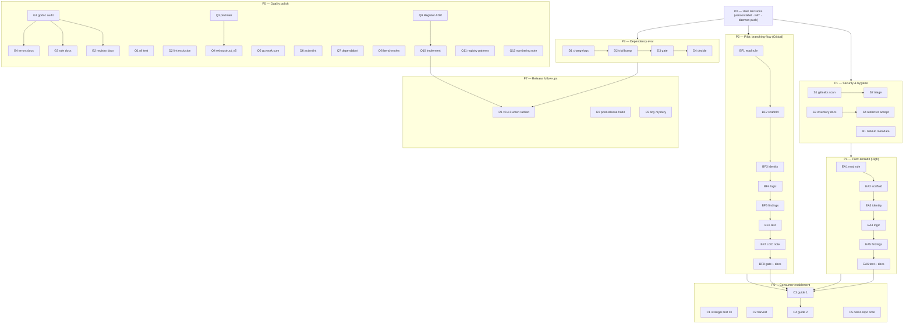

# Execution Plan — Prioritized Micro-Tasks (≤ 12 min each)

**Written:** 2026-09-09 04:18 CEST · **Source snapshot:** `docs/status/2026-09-09_04-18_docs-health-followups-v0.3.1-release-support-posture.md` (section f)
**Status:** ✅ **EXECUTED 2026-09-09.** All tasks complete except: **Q2 won't-do** (package-level nolint empirically unsupported by golangci-lint v2 — per-line directives stay), **Q10 decided-keep** (ADR: Register keeps panicking; no API movement), **R1 stays gated** (no real API change; v0.4.0 waits per AGENTS user decisions), **C5 deferred** (ROADMAP Q7 with recommendation). Evidence and narrative: `CHANGELOG.md` `[Unreleased]`; the R3 tidy mystery was solved (go.work contamination — see AGENTS).

## Context

- **Repo:** `github.com/larsartmann/go-linter-sdk`, public since 2026-09-08, current release **v0.3.1** (docs/policy release on `88bf9fa`, CI green).
- **What just happened:** full docs-health follow-up pass; v0.3.1 shipped (pkg.go.dev now renders the corrected README); `PRIVATE_REPO_TOKEN` secret deleted; open support posture in place (`SUPPORT.md`, `SECURITY.md`, templates).
- **The point of this SDK:** delete converter layers in the LarsArtmann linters (branching-flow 1,871 LOC, erraudit 1,214 LOC). The pilot ports (BF/EA phases) are the #1 customer-value proof — nothing else on the list matters as much for adoption.
- **Newest known unknowns:** go-finding v1.8.0/v1.9.2 upstream vs v1.7.0 pinned; one unexplained CI tidy contradiction (green on `487d254`, red on identical `go.sum` later).
- **Environment facts that constrain every task:** every `go` command needs `GOEXPERIMENT=jsonv2` (use `nix run .#test|lint|vet|build|test-race`); CI ignores docs-only pushes (`paths-ignore`); the auto-git daemon commits continuously (never rewrite history; CHANGELOG is the narrative of record); coverage gate measures library packages only (do not "fix" to `./...`).

## Phases

- **P0 — User decisions (blocking, not tasks):** version-label ratification, PAT rotation, daemon push policy (status report §g).
- **P1 — Security & hygiene (S1–S4, M1):** the repo is world-visible NOW; this is cheap insurance.
- **P2 — Pilot port: branching-flow (BF1–BF8):** Critical. Proves converter-deletion at scale.
- **P3 — Dependency evaluation (D1–D4):** decide the go-finding pin consciously.
- **P4 — Pilot port: erraudit (EA1–EA6):** High. Second domain proof.
- **P5 — Quality polish (G1–G4, Q1–Q12):** godoc storefront + small hardening items.
- **P6 — Consumer enablement (C1–C5):** migration guide, stranger-test CI, demo repo.
- **P7 — Release follow-ups (R1–R3):** only after their preconditions.

## Task breakdown

| ID      | Task                                               | Context & acceptance criteria                                                                                                                                                                | Depends on                   |
| ------- | -------------------------------------------------- | -------------------------------------------------------------------------------------------------------------------------------------------------------------------------------------------- | ---------------------------- |
| S1      | Run gitleaks full-history scan                     | `nix run nixpkgs#gitleaks detect --source . --redact -v` plus `--log-opts="all"`. Acceptance: scan completed, report saved to `reports/gitleaks.txt` (gitignored)                            | P0.2 (rotate if hits)        |
| S2      | Triage gitleaks findings                           | Every hit classified: real secret → rotate + purge decision (user); false positive → document. Acceptance: zero unclassified hits                                                            | S1                           |
| S3      | Inventory sensitive narratives in docs             | grep docs/ for token-provisioning, hostnames, PAT stories (e.g. `2026-09-09_02-10` f.8). Acceptance: list with file:line                                                                     | —                            |
| S4      | Redact or accept                                   | Prune/redact each S3 hit OR write a dated acceptance note in the file. Acceptance: every hit has a verdict                                                                                   | S3                           |
| M1      | Set GitHub metadata                                | `gh repo edit --description --homepage https://pkg.go.dev/github.com/larsartmann/go-linter-sdk --add-topic go,linter,static-analysis`. Acceptance: `gh repo view` shows them; closes TODO #6 | —                            |
| BF1     | Read branching-flow's smallest rule + converter    | Sibling `/home/lars/projects/branching-flow`. Pick the smallest rule; note its converter LOC. Acceptance: chosen rule + LOC number recorded here                                             | —                            |
| BF2     | Scaffold `examples/branching-flow-port`            | Copy `examples/no-go-mod` skeleton. Acceptance: `nix run .#build` green with a stub rule                                                                                                     | BF1                          |
| BF3     | Port RuleMeta identity                             | ID/Name/Description/Cat/Sev from the original rule; keep the original rule ID for suppression compatibility. Acceptance: registers without panic                                             | BF2                          |
| BF4     | Port Run closure logic                             | Faithful port of the detection logic, no behavior change. Acceptance: logic lines reviewed against original                                                                                  | BF3                          |
| BF5     | Port finding emission                              | Use `RuleFunc.NewFinding` or `NewBuilder` + Confidence/FixStrategy where the original had them. Acceptance: findings match the old linter's shape                                            | BF4                          |
| BF6     | Integration test                                   | Extend `examples_integration_test.go` pattern: build, run against fixture, assert output/exit. Acceptance: `nix run .#test` green                                                            | BF5                          |
| BF7     | LOC comparison note                                | Original converter LOC vs port LOC (expected: large deletion, small addition). Acceptance: numbers written into this file + CHANGELOG draft                                                  | BF6                          |
| BF8     | Gate + docs sync                                   | lint/vet/race/flake green; FEATURES/CHANGELOG/README consumer table updated. Acceptance: TODO #7 closed                                                                                      | BF7                          |
| D1      | Read go-finding v1.8/v1.9 changelogs               | Upstream releases/CHANGELOG. Acceptance: breaking-change list written here                                                                                                                   | —                            |
| D2      | Trial bump on scratch branch                       | `go get go-finding@v1.9.2 && go mod tidy`. Acceptance: compiles or diff of breakage recorded                                                                                                 | D1                           |
| D3      | Gate the bump                                      | Full gate on the branch. Acceptance: green, or documented failures                                                                                                                           | D2                           |
| D4      | Decide pin-vs-bump                                 | Record decision in CHANGELOG/AGENTS; close TODO #9 either way                                                                                                                                | D3                           |
| EA1–EA6 | erraudit pilot (mirror BF1–BF6)                    | Sibling `/home/lars/projects/erraudit`; same acceptance criteria per step; closes TODO #8                                                                                                    | EA1→…→EA6                    |
| G1      | Godoc audit                                        | Compare every exported symbol's doc on pkg.go.dev v0.3.1 vs DOMAIN_LANGUAGE truth. Acceptance: gap list with symbol names                                                                    | —                            |
| G2      | Godoc rewrites: Registry/Run family                | Run, RunOption, ContinueOnError, Detector* adapters. Acceptance: gaps from G1 for this family closed                                                                                         | G1                           |
| G3      | Godoc rewrites: Rule/RuleFunc/RuleMeta/Category    | Acceptance: gaps closed                                                                                                                                                                      | G1                           |
| G4      | Godoc rewrites: errors family + examples           | RuleError/RuleErrors/ErrMissingFields/ErrRuleFailed + 7 Example funcs. Acceptance: gaps closed; gate green                                                                                   | G1                           |
| Q1      | Test collectRuleErrors nil elements                | Table test with nils inside an errors.Join. Acceptance: test added, race-clean                                                                                                               | —                            |
| Q2      | Package-level lint exclusion for integration tests | Replace per-line nolint in `*_integration_test.go` with one package comment. Acceptance: lint green, fewer nolint lines                                                                      | —                            |
| Q3      | Pin golangci-lint in devShell                      | Match CI's v2.12.x. Acceptance: devShell lint version == CI version                                                                                                                          | —                            |
| Q4      | exhaustruct → exhaustruct_v5                       | Only after Q3 verified. Acceptance: lint green, deprecation warning gone                                                                                                                     | Q3                           |
| Q5      | Generate go.work.sum                               | `go work sync` + build inside workspace. Acceptance: file exists, build green                                                                                                                | —                            |
| Q6      | actionlint in CI                                   | Add step before test job. Acceptance: green run including a deliberately broken YAML locally                                                                                                 | —                            |
| Q7      | dependabot config                                  | `.github/dependabot.yml` (gomod + actions, weekly). Acceptance: valid config; first check run appears                                                                                        | —                            |
| Q8      | Benchmarks Get/Has/Deregister                      | 100/500/1000 rules, `-benchmem`. Acceptance: baseline numbers recorded                                                                                                                       | —                            |
| Q9      | ADR draft: Register panic-vs-error                 | `docs/decisions/` or ROADMAP appendix; arguments both ways. Acceptance: draft exists                                                                                                         | —                            |
| Q10     | Decide + implement Register contract               | Per ADR; if changed: breaking → v0.4.0 minor. Acceptance: decision recorded, code matches                                                                                                    | Q9                           |
| Q11     | README registry patterns section                   | init-time, plugin, dynamic Deregister patterns. Acceptance: section merged, links checked                                                                                                    | —                            |
| Q12     | TODO_LIST numbering-gap note                       | One HTML comment line explaining the gap at #4                                                                                                                                               | —                            |
| C1      | Stranger-test CI job                               | Clean dir, `go get @latest`, build hello-linter. Acceptance: green run on a PR                                                                                                               | —                            |
| C2      | HARVEST this plan into ROADMAP/TODO                | Stranger-test CI + demo repo → ROADMAP; verify no new un-routed items                                                                                                                        | —                            |
| C3      | Migration guide part 1                             | Skeleton + migration-path expansion from README. Acceptance: draft in `docs/`                                                                                                                | BF8, EA6                     |
| C4      | Migration guide part 2                             | Real walkthrough citing BF/EA numbers. Acceptance: complete guide linked from README                                                                                                         | C3                           |
| C5      | Demo repo decision note                            | Options + recommendation in ROADMAP (#38). Acceptance: decision or explicit defer                                                                                                            | —                            |
| R1      | Cut v0.4.0 (only if ratified + API movement)       | Follow go-release skill exactly: green CI on exact commit → annotated tag → verify proxy/pkg.go.dev                                                                                          | P0.1, Q10 or next API change |
| R2      | Post-release habit note                            | Add to AGENTS gotcha: after each release, check pkg.go.dev @latest + Imported-by                                                                                                             | —                            |
| R3      | Tidy-mystery resolution                            | Try to reproduce (same go.sum, cold cache, 1.26.5 vs 1.26.7); if unexplainable, note in AGENTS as environment-dependent                                                                      | —                            |

## Execution graph

Parallelism: P1 ∥ P2 ∥ P3 ∥ P5 can run concurrently (different files); P4 after P1 (security posture settled); C3/C4 strictly after both pilots; R1 only after ratification AND real API movement.

## Guardrails (VERSCHLIMMBESSER-Prävention)

1. **Tags are immutable** — never move/delete `v0.3.1`; fixes get new versions (go-release skill).
2. **CHANGELOG is append-only** — prior sections never edited, even for loose wording.
3. **Never rewrite git history** — the daemon owns commits; bad messages stay, narrative lives in CHANGELOG.
4. **Integrity-check every scripted/bulk file edit** (line count + head/tail) before moving on.
5. **Do not renumber TODO_LIST** — historical reports reference item numbers.
6. **Coverage gate stays library-only**; CI `paths-ignore` stays as-is unless deliberately revisited.
7. **One task per commit-cycle; full gate before declaring any task done.**
8. **Any task exceeding 12 minutes gets split, not stretched** — that is the point of this file.

## Definition of done (per task)

Acceptance criteria met · gate green (`nix run .#lint`, `.#test`, `nix flake check` where relevant) · CHANGELOG `[Unreleased]` entry if user-visible · TODO_LIST/ROADMAP row updated · this table's row marked done inline.
